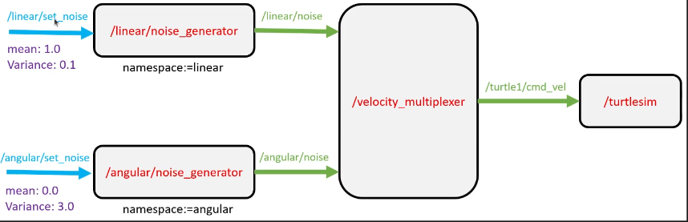
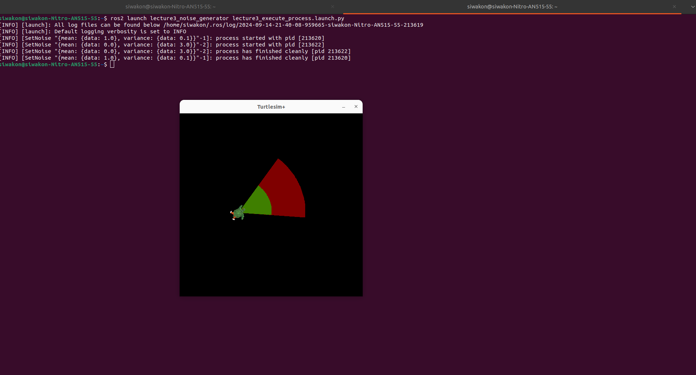

## Noise generator for control turtlesim plus ( Random Walk System )

[Video Lectures](https://drive.google.com/drive/folders/1jGeKOIWiad_GzL5rlh3OnR4Bi1f7OaLy?usp=sharing).




## Call ros2 service with launch file ( ExecuteProcess ).

```python 
from launch import LaunchDescription
from launch.actions import ExecuteProcess
from launch.substitutions import FindExecutable


PACKAGE_NAME = 'lecture3_interfaces'


def generate_launch_description():

    ld = LaunchDescription()

    services = {
            "linear": {"mean": 1.0, "var": 0.1},
            "angular": {"mean": 0.0, "var": 3.0}
    }

    for key, value in services.items():
        mean = value['mean']
        variance = value['var']
        execute_process = ExecuteProcess(
            cmd=[[
                FindExecutable(name='ros2'),
                " service call ",
                f"/{key}/set_noise ",
                f"{PACKAGE_NAME}/srv/SetNoise ",
                f'"{{mean: {{data: {mean}}}, variance: {{data: {variance}}}}}"',
            ]],
            shell=True
        )
        ld.add_action(execute_process)

    return ld
```


