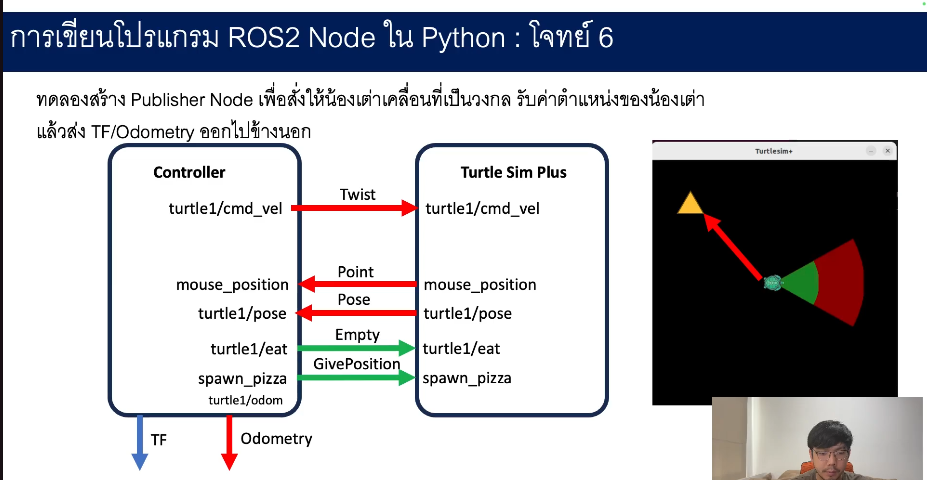
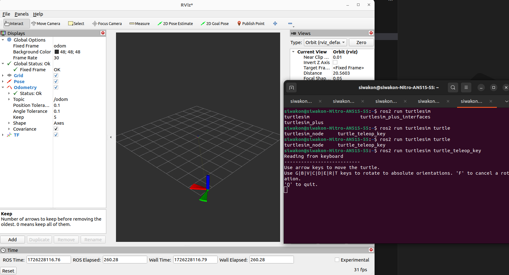
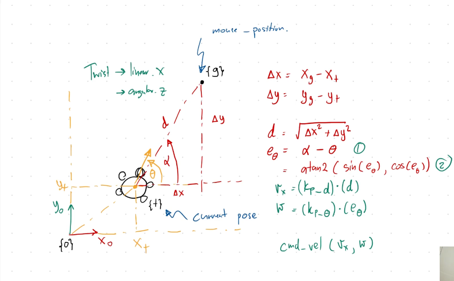

# ROS 2 Workspace Setup and Development Guide
[Video Lectures](https://drive.google.com/drive/folders/10JGUxAyZ1yhHVFOV59r-1GX_yCHls2Np?usp=sharing).

## Table of Contents
1. [Workspace and Packages](#workspace-and-packages)
2. [Creating Packages, Nodes, and Topics](#creating-packages-nodes-and-topics)
3. [Cloning Repositories and Building](#cloning-repositories-and-building)
4. [Adding Python Dependencies](#adding-python-dependencies)
5. [Topic Publishing and Subscribing](#topic-publishing-and-subscribing)
6. [Service Clients](#service-clients)
7. [Odometry](#odometry)
8. [Adding a Node](#adding-a-node)
9. [RViz2](#rviz2)
10. [Simple Controller](#simple-controller)

## Workspace and Packages

### Create ROS2 Workspace
- Create a workspace:
   ```bash
   mkdir -p ~/ros2_ws/src
   cd ~/ros2_ws
   ```
- Build the workspace:
   ```bash
   colcon build
   ```
- Install colcon using the following command:
   ```bash
   sudo apt install python3-colcon-common-extensions
   ```
- For more details, refer to the [Colcon Tutorial](https://docs.ros.org/en/humble/Tutorials/Beginner-Client-Libraries/Colcon-Tutorial.html).
---

## Creating Packages, Nodes, and Topics
### Create Package using ROS2_pkg_cpp_py

- Create Package using ROS2_pkg_cpp_py
   ```bash
   git clone https://github.com/tchoopojcharoen/ROS2_pkg_cpp_py.git
   ```
- Generate the package:
   ```bash
   dos2unix ROS2_pkg_cpp_py/install_pkg.bash
   . ROS2_pkg_cpp_py/install_pkg.bash {YOUR_WORKSPACE} {PACKAGE_NAME}
   ```
    Example:
    ```bash
    . ROS2_pkg_cpp_py/install_pkg.bash ros2_ws lecture2
    ```
---

## Cloning Repositories and Building

Follow the instructions for installing ROS 2 Humble (deb packages) on Ubuntu Jammy Jellyfish (22.04) from [this link](https://docs.ros.org/en/humble/Installation.html).

### Clone Example Packages:
1. Clone the example repository into the workspace:
    ```bash
    cd ~/ros2_ws
    git clone https://github.com/ros2/examples src/examples -b humble
    ```
2. Build the workspace:
    ```bash
    colcon build
    ```
3. Run example nodes:
    ```bash
    ros2 run examples_rclcpp_minimal_subscriber subscriber_member_function
    ros2 run examples_rclcpp_minimal_publisher publisher_member_function
    ```
### Clone and Run [turtlesim_plus](https://github.com/tchoopojcharoen/turtlesim_plus)
- Clone the turtlesim_plus repository:
    ```bash
    git clone https://github.com/tchoopojcharoen/turtlesim_plus.git ~/ros2_ws/src
    ```
- Build the workspace:
    ```bash
    colcon build
    ```
- Run the nodes:
    ```bash
    ros2 run turtlesim_plus turtlesim_plus_node.py
    ros2 run turtlesim turtle_teleop_key
    ```
---

## Adding Python Dependencies
Add the following script to `CMakeLists.txt` to check for Python and pip, and to install dependencies:
```bash
    # Find Python executable
    find_program(PYTHON_EXECUTABLE python3)
    if(NOT PYTHON_EXECUTABLE)
      message(FATAL_ERROR "Python 3 not found. Please install Python 3 to proceed.")
    endif()
    
    # Find pip, or install it if not found
    find_program(PIP_EXECUTABLE pip3)
    if(NOT PIP_EXECUTABLE)
      message(STATUS "pip not found. Attempting to install pip...")
      # Install pip using get-pip.py
      execute_process(
        COMMAND ${PYTHON_EXECUTABLE} -c "import urllib.request; urllib.request.urlretrieve('https://bootstrap.pypa.io/get-pip.py', 'get-pip.py')"
        RESULT_VARIABLE DOWNLOAD_GET_PIP_RESULT
      )
      if(NOT DOWNLOAD_GET_PIP_RESULT EQUAL "0")
        message(FATAL_ERROR "Failed to download get-pip.py.")
      endif()
      # Install pip locally
      execute_process(
        COMMAND ${PYTHON_EXECUTABLE} get-pip.py --user
        RESULT_VARIABLE RUN_GET_PIP_RESULT
      )
      if(NOT RUN_GET_PIP_RESULT EQUAL "0")
        message(FATAL_ERROR "Failed to install pip using get-pip.py.")
      else
        # Add ~/.local/bin to PATH
        set(LOCAL_PIP_PATH "$ENV{HOME}/.local/bin")
        if(EXISTS ${LOCAL_PIP_PATH})
          set(ENV{PATH} "$ENV{PATH}:${LOCAL_PIP_PATH}")
          find_program(PIP_EXECUTABLE pip3 PATHS ${LOCAL_PIP_PATH})
        endif()
      endif()
      file(REMOVE get-pip.py)
    endif()
    
    if(NOT PIP_EXECUTABLE)
      message(FATAL_ERROR "Failed to install pip.")
    endif()
    
    # Install Python dependencies from requirements.txt
    if(EXISTS "${CMAKE_CURRENT_SOURCE_DIR}/requirements.txt")
      execute_process(
        COMMAND ${PIP_EXECUTABLE} install --user -r ${CMAKE_CURRENT_SOURCE_DIR}/requirements.txt
        RESULT_VARIABLE PIP_INSTALL_RESULT
      )
      if(NOT PIP_INSTALL_RESULT EQUAL "0")
        message(FATAL_ERROR "Failed to install Python dependencies using pip.")
      endif()
    endif()
```
## Topic Publishing and Subscribing
### Publishing to a Topic
- List topics:
    ```bash
    ros2 topic list
    ```
- Publish to the `/turtle1/cmd_vel` topic:
    ```bash
    ros2 topic pub /turtle1/cmd_vel geometry_msgs/msg/Twist "linear:
          x: 0.0
          y: 0.0
          z: 0.0
        angular:
          x: 0.0
          y: 0.0
          z: 0.0"
    ```
### Subscribing to a Topic
- View the type of a topic:
    ```bash
    ros2 topic type /turtle1/pose
    ```
- Display the topic information:
    ```bash
    ros2 interface show turtlesim/msg/Pose
    ```
---
##  Service Clients
- List available services:
    ```bash
    ros2 service list
    ```
- View the service type:
    ```bash
    ros2 service type /turtle1/eat
    ```
- Show the service interface:
    ```bash
    ros2 interface show std_srvs/srv/Empty
    ```
---
##  Odometry


- Use `nav_msgs/Odometry` and `tf2_ros/TransformBroadcaster` for odometry:
    ```bash
    from nav_msgs.msg import Odometry
    from tf2_ros import TransformBroadcaster
    ```
- Add dependencies in `package.xml`:
    ```bash
    <depend>rclpy</depend>
    <depend>nav_msgs</depend>
    <depend>geometry_msgs</depend>
    <depend>tf-transformations</depend>
    ```
- Add python dependencies lib in `requirements.txt`:
    ```bash
    transforms3d==0.4.2
    ```
---
## Adding a Node
- Add the following lines to `CMakeLists.txt` to install Python executables:
    ```bash
    # Install Python executables
    install(PROGRAMS
    scripts/dummy_script.py
    scripts/manual_teleop.py
    DESTINATION lib/${PROJECT_NAME})
    ```
- Change the script's permissions:
    ```bash
    sudo chmod +x manual_teleop.py
    ```
- Rebuild the workspace:
    ```bash
    colcon build
    ```
---
## RViz2

Refer to ROS 2 documentation for integrating RViz2 with nodes and topics for visualization.


---
## Simple Controller

Control methods.


```python 
def simple_controller(self, goal_position, index):
        kp_d = 1.5
        kp_w = 3.0
        dp =  goal_position - np.array([self.robot_pose[0], self.robot_pose[1]])
        vx = kp_d * np.linalg.norm(dp)
        e = np.arctan2(dp[1],dp[0]) - self.robot_pose[2]
        w = kp_w * np.arctan2(np.sin(e),np.cos(e))
        if np.linalg.norm(dp) >= 0.5:
            return vx, w
        vx, w = 0.0, 0.0
        self.goal_positions.pop(index)
        return vx, w
        
 def timer_callback(self):
        if self.goal_positions:
            vx, w = self.simple_controller(goal_position=self.goal_positions[0], index=0)
            self.cmd_vel(v=vx, w=w)
            self.eat_pizza()
        else:
            self.cmd_vel(v=0.0, w=0.0)
```



Result.


---

