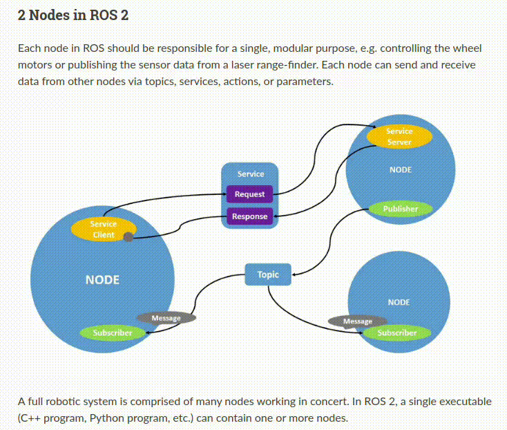

# ROS2 Humble Installation and Basic Usage Guide

## Table of Contents
1. [Basic Linux Commands](#basic-linux-commands)
2. [ROS 2 Installation](#ros-2-installation)
3. [ROS 2 Basic Commands](#ros-2-basic-commands)
4. [Understanding Nodes](#understanding-nodes)
5. [Understanding Topics](#understanding-topics)
6. [Understanding Services](#understanding-services)
7. [Understanding Parameters](#understanding-parameters)
8. [Understanding Actions](#understanding-actions)
9. [Launching Nodes](#launching-nodes)

---

## Basic Linux Commands

1. `ls` - List files in the current directory.
2. `la` - List files in the current directory (including hidden files).
3. `cd ..` - Move up one directory level.
4. `pwd` - Print the current working directory.
5. `cd Downloads/` - Change to the `Downloads` directory.
6. `mkdir FIBO` - Create a new directory named `FIBO`.
7. `cd FIBO/src/` - Change to the `src` directory under `FIBO`.
8. `gedit test.txt` - Open or create `test.txt` using the gedit editor.
9. `cp test.txt ~/FIBO/` - Copy `test.txt` to the `~/FIBO/` directory.
10. `rm -r test.txt` - Delete the `test.txt` file.
11. `rm -r src/` - Delete the `src/` directory and its contents.
12. `sudo apt-get update` - Update the package lists for upgrades and new installations.

---

## ROS2 Installation

Follow the instructions for installing ROS 2 Humble (deb packages) on Ubuntu Jammy Jellyfish (22.04) from [this link](https://docs.ros.org/en/humble/Installation.html).

### Steps:
1. Install ROS 2 using the command:
    ```bash
    sudo apt install ros-humble-desktop-full
    ```
2. Set up the ROS environment by adding the following to `.bashrc`:
    ```bash
    nano ~/.bashrc
    source /opt/ros/humble/setup.bash
    ```
3. Test ROS 2 by running the following commands:
    ```bash
    ros2 run demo_nodes_cpp talker
    ros2 run demo_nodes_py listener
    ```

---

## ROS2 Basic Commands

### Terminal always on top (Tip)
You can keep your terminal always on top using settings in your terminal or desktop environment.

### ROS2 CLI tools:
- To set ROS Domain ID in `.bashrc`:
    ```bash
    export ROS_DOMAIN_ID=3
    ```
- To check if a package is installed:
    ```bash
    ros2 pkg executables turtlesim
    ```
- ROS 2 communication mechanism:
    ```bash
    ros2 node list
    ros2 topic list
    ros2 service list
    ros2 action list
    ```
- Install `rqt` to monitor topics, services, and actions:
    ```bash
    sudo apt install '~nros-humble-rqt*'
    ```
- To remap topics:
    ```bash
    ros2 run turtlesim turtle_teleop_key --ros-args --remap /turtle1/cmd_vel:=/turtle2/cmd_vel
    ```

---

## ROS2 Nodes


For a deeper understanding of ROS 2 nodes and their communication mechanisms, visit the [official ROS 2 documentation](https://docs.ros.org/en/humble/Tutorials/Beginner-CLI-Tools/Understanding-ROS2-Nodes/Understanding-ROS2-Nodes.html).

### Node Communication Mechanism

ROS2 nodes can communicate with each other through the following mechanisms:

1. **Topics**: Unidirectional communication where one node can publish data and another node can subscribe to receive it.
2. **Services**: Bidirectional communication where a node can send a request and another node can respond.
3. **Actions**: Goal-oriented, asynchronous communication. Nodes can send a goal to another node and receive feedback during execution.

### Remapping Node Names

Node names can be remapped at runtime using the `--ros-args --remap` option. For example, to remap the node name from `turtlesim_node` to `my_turtle`, run the following command:
- To remap node:
    ```bash
    ros2 run turtlesim turtlesim_node --ros-args --remap __node:=my_turtle
    ```
### Node Information
- To check node information:
    ```bash
    ros2 node info /my_turtle
    ---
    /my_turtle
      Subscribers:
        /parameter_events: rcl_interfaces/msg/ParameterEvent
        /turtle1/cmd_vel: geometry_msgs/msg/Twist
      Publishers:
        /parameter_events: rcl_interfaces/msg/ParameterEvent
        /rosout: rcl_interfaces/msg/Log
        /turtle1/color_sensor: turtlesim/msg/Color
        /turtle1/pose: turtlesim/msg/Pose
      Service Servers:
        /clear: std_srvs/srv/Empty
        /kill: turtlesim/srv/Kill
        /my_turtle/describe_parameters: rcl_interfaces/srv/DescribeParameters
        /my_turtle/get_parameter_types: rcl_interfaces/srv/GetParameterTypes
        /my_turtle/get_parameters: rcl_interfaces/srv/GetParameters
        /my_turtle/list_parameters: rcl_interfaces/srv/ListParameters
        /my_turtle/set_parameters: rcl_interfaces/srv/SetParameters
        /my_turtle/set_parameters_atomically: rcl_interfaces/srv/SetParametersAtomically
        /reset: std_srvs/srv/Empty
        /spawn: turtlesim/srv/Spawn
        /turtle1/set_pen: turtlesim/srv/SetPen
        /turtle1/teleport_absolute: turtlesim/srv/TeleportAbsolute
        /turtle1/teleport_relative: turtlesim/srv/TeleportRelative
      Service Clients:
      Action Servers:
        /turtle1/rotate_absolute: turtlesim/action/RotateAbsolute
      Action Clients:
    ```
---
## ROS2 Topics

For a detailed guide on understanding ROS 2 topics, you can refer to the [ROS 2 documentation](https://docs.ros.org/en/humble/Tutorials/Beginner-CLI-Tools/Understanding-ROS2-Topics/Understanding-ROS2-Topics.html).
### ROS2 Topics Monitor:
- Type rqt_graph in the command:
    ```bash
    rqt_graph
    ```
- To list all ros2 topics (including message type):
    ```bash
    ros2 topic list -t
    ---
    /parameter_events [rcl_interfaces/msg/ParameterEvent]
    /rosout [rcl_interfaces/msg/Log]
    /turtle1/cmd_vel [geometry_msgs/msg/Twist]
    /turtle1/color_sensor [turtlesim/msg/Color]
    /turtle1/pose [turtlesim/msg/Pose]
    ```
- To echo to see data that streamed from topic:
    ```bash
    ros2 topic echo /turtle1/cmd_vel
    ```
- To check topic information:
    ```bash
    ros2 topic info /turtle1/cmd_vel
    ---
    Type: geometry_msgs/msg/Twist
    Publisher count: 1
    Subscription count: 1
    ```
- To show topic interface:
    ```bash
    ros2 interface show geometry_msgs/msg/Twist
    ---
    # This expresses velocity in free space broken into its linear and angular parts.
    Vector3  linear
    	float64 x
    	float64 y
    	float64 z
    Vector3  angular
    	float64 x
    	float64 y
    	float64 z
    ```
- To publish topic (One times):
    ```bash
    Once ros2 topic pub --once /turtle1/cmd_vel geometry_msgs/msg/Twist "{linear: {x: 2.0, y: 0.0, z: 0.0}, angular: {x: 0.0, y: 0.0, z: 1.8}}"
    ```
- To publish topic (With feq 1 hz):
    ```bash
    ros2 topic pub --rate 1 /turtle1/cmd_vel geometry_msgs/msg/Twist "{linear: {x: 2.0, y: 0.0, z: 0.0}, angular: {x: 0.0, y: 0.0, z: 1.8}}"
    ```
- To check topic rate:
    ```bash
    ros2 topic hz /turtle1/pose
    ```
---
## ROS2 Services

In ROS 2, services are used for synchronous communication between nodes, allowing one node to send a request and receive a response from another node. For more information, visit the official ROS 2 documentation on services: [ROS 2 Services](https://docs.ros.org/en/humble/Tutorials/Beginner-CLI-Tools/Understanding-ROS2-Services/Understanding-ROS2-Services.html).

### Basic Commands

- List available services:
    ```bash
    ros2 service list
    ```

- Get the type of a specific service:
    ```bash
    ros2 service type <service_name>
    ```
   Example:
    ```bash
    ros2 service type /clear
    ```

- List services with their types:
    ```bash
    ros2 service list -t
    ```
   Example output:
    ```
    /clear [std_srvs/srv/Empty]
    /kill [turtlesim/srv/Kill]
    /reset [std_srvs/srv/Empty]
    /spawn [turtlesim/srv/Spawn]
    /teleop_turtle/describe_parameters [rcl_interfaces/srv/DescribeParameters]
    /teleop_turtle/get_parameter_types [rcl_interfaces/srv/GetParameterTypes]
    /teleop_turtle/get_parameters [rcl_interfaces/srv/GetParameters]
    /teleop_turtle/list_parameters [rcl_interfaces/srv/ListParameters]
    /teleop_turtle/set_parameters [rcl_interfaces/srv/SetParameters]
    /teleop_turtle/set_parameters_atomically [rcl_interfaces/srv/SetParametersAtomically]
    /turtle1/set_pen [turtlesim/srv/SetPen]
    /turtle1/teleport_absolute [turtlesim/srv/TeleportAbsolute]
    /turtle1/teleport_relative [turtlesim/srv/TeleportRelative]
    ```

- Find all services of a particular type:
    ```bash
    ros2 service find <type_name>
    ```
   Example:
    ```bash
    ros2 service find std_srvs/srv/Empty
    ```

- Show service interface details:
    ```bash
    ros2 interface show <type_name>
    ```
   Example:
    ```bash
    ros2 interface show std_srvs/srv/Empty
    ros2 interface show turtlesim/srv/Spawn
    ```

   Example interface for `turtlesim/srv/Spawn`:
    ```
    float32 x
    float32 y
    float32 theta
    string name  # Optional. A unique name will be created if this is empty
    ---
    string name
    ```

### Service Call Examples

- Call a service to spawn a turtle:
    ```bash
    ros2 service call /spawn turtlesim/srv/Spawn "{x: 2, y: 2, theta: 0.2, name: ''}"
    ```

- Call the spawn service with more detailed parameters:
    ```bash
    ros2 service call /spawn turtlesim/srv/Spawn "x: 3.8
    y: 8.0
    theta: 0.0
    name: 'turtle2'"
    ```

- Call a service to clear the screen:
    ```bash
    ros2 service call /clear std_srvs/srv/Empty "{}"
    ```
---
## ROS2 Parameters

ROS 2 parameters allow you to configure nodes at runtime without changing the source code. You can list, get, set, dump, and load parameters for nodes. For more information on using parameters in ROS 2, refer to the [official ROS 2 documentation](https://docs.ros.org/en/humble/Tutorials/Beginner-CLI-Tools/Understanding-ROS2-Parameters/Understanding-ROS2-Parameters.html).

### Basic Commands

- List all parameters for a node:
    ```bash
    ros2 param list
    ```
    Example output:
    ```
    /teleop_turtle:
      qos_overrides./parameter_events.publisher.depth
      qos_overrides./parameter_events.publisher.durability
      qos_overrides./parameter_events.publisher.history
      qos_overrides./parameter_events.publisher.reliability
      scale_angular
      scale_linear
      use_sim_time
    /turtlesim:
      background_b
      background_g
      background_r
      qos_overrides./parameter_events.publisher.depth
      qos_overrides./parameter_events.publisher.durability
      qos_overrides./parameter_events.publisher.history
      qos_overrides./parameter_events.publisher.reliability
      use_sim_time
    ```

- Get the value of a parameter:
    ```bash
    ros2 param get /turtlesim background_g
    ```

- Set the value of a parameter:
    ```bash
    ros2 param set /turtlesim background_g 255
    ```

- Dump the parameters of a node to a YAML file:
    ```bash
    ros2 param dump /turtlesim > turtlesim.yaml
    ```
    Example command output:
    ```bash
    siwakon@siwakon-Nitro-AN515-55:~$ ls
    Desktop    Downloads  Music     Public  Templates       Videos
    Documents  FIBO       Pictures  snap    turtlesim.yaml
    ```

- Load parameters from a YAML file:
    ```bash
    ros2 param load /turtlesim turtlesim.yaml
    ```
    Example output:
    ```
    Set parameter background_b successful
    Set parameter background_g successful
    Set parameter background_r successful
    Set parameter qos_overrides./parameter_events.publisher.depth failed: parameter 'qos_overrides./parameter_events.publisher.depth' cannot be set because it is read-only
    Set parameter qos_overrides./parameter_events.publisher.durability failed: parameter 'qos_overrides./parameter_events.publisher.durability' cannot be set because it is read-only
    Set parameter qos_overrides./parameter_events.publisher.history failed: parameter 'qos_overrides./parameter_events.publisher.history' cannot be set because it is read-only
    Set parameter qos_overrides./parameter_events.publisher.reliability failed: parameter 'qos_overrides./parameter_events.publisher.reliability' cannot be set because it is read-only
    Set parameter use_sim_time successful
    ```

- Run a node with parameters loaded from a file:
    ```bash
    ros2 run turtlesim turtlesim_node --ros-args --params-file turtlesim.yaml
    ```
---
## ROS2 Actions

ROS 2 actions are used for goal-oriented, asynchronous communication where nodes can send goals, receive feedback, and get results. Actions are similar to services but allow for continuous feedback during execution. For more detailed information about actions, refer to the [ROS 2 Actions documentation](https://docs.ros.org/en/humble/Tutorials/Beginner-CLI-Tools/Understanding-ROS2-Actions/Understanding-ROS2-Actions.html).

### Basic Commands

- List action servers for a node:
    ```bash
    ros2 node info /turtlesim
    ```
    Example output:
    ```
    Action Servers: 
    /turtle1/rotate_absolute: turtlesim/action/RotateAbsolute
    ```

- List available actions:
    ```bash
    ros2 action list
    ```

- Show the interface of an action:
    ```bash
    ros2 interface show turtlesim/action/RotateAbsolute
    ```
    Example output:
    ```
    # The desired heading in radians
    float32 theta
    ---
    # The angular displacement in radians to the starting position
    float32 delta
    ---
    # The remaining rotation in radians
    float32 remaining
    ```

- Send a goal to an action server:
    ```bash
    ros2 action send_goal /turtle1/rotate_absolute turtlesim/action/RotateAbsolute "theta: 1.57"
    ```
---

## ROS2 Launching Nodes

Launch files in ROS 2 allow you to start multiple nodes with predefined parameters and configurations.

### Example Launch File

- To launch multiple turtlesim nodes, create a launch file such as `multisim.launch.py`:
    ```bash
    ros2 launch turtlesim multisim.launch.py
    ```
    ```bash
        # turtlesim/launch/multisim.launch.py
		from launch import LaunchDescription
		import launch_ros.actions

		def generate_launch_description():
		    return LaunchDescription([
			launch_ros.actions.Node(
			    namespace= "turtlesim1", package='turtlesim', executable='turtlesim_node', output='screen'),
			launch_ros.actions.Node(
			    namespace= "turtlesim2", package='turtlesim', executable='turtlesim_node', output='screen'),
		    ])
		    
	- ros2 topic pub  /turtlesim1/turtle1/cmd_vel geometry_msgs/msg/Twist "{linear: {x: 2.0, y: 0.0, z: 0.0}, angular: {x: 0.0, y: 0.0, z: 1.8}}"
	
	- 
    ```
- To publish topic (turtlesim1):
    ```bash
    ros2 topic pub  /turtlesim1/turtle1/cmd_vel geometry_msgs/msg/Twist "{linear: {x: 2.0, y: 0.0, z: 0.0}, angular: {x: 0.0, y: 0.0, z: 1.8}}"
    ```
- To publish topic (turtlesim2):
    ```bash
    ros2 topic pub  /turtlesim2/turtle1/cmd_vel geometry_msgs/msg/Twist "{linear: {x: 2.0, y: 0.0, z: 0.0}, angular: {x: 0.0, y: 0.0, z: -1.8}}"
    ```


    
