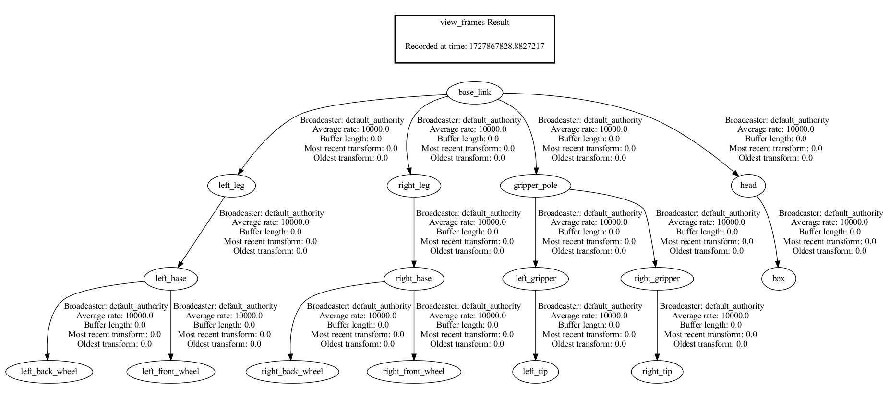

# URDF Tutorial: Building a Visual Robot Model from Scratch

This guide provides instructions for setting up and visualizing a URDF-based robot model using ROS 2. The tutorial follows the official documentation and covers various stages of URDF creation and visualization using the `urdf_tutorial` package in ROS 2.

## Table of Contents
1. [Prerequisites](#prerequisites)
2. [Installing `urdf_tutorial` Package](#installing-urdf_tutorial-package)
3. [Adding Dependencies](#adding-dependencies)
   - [Modifying `package.xml`](#modifying-packagexml)
   - [Modifying `CMakeLists.txt`](#modifying-cmakeliststxt)
4. [Building and Launching the Robot Models](#building-and-launching-the-robot-models)
   - [Building the Package](#building-the-package)
   - [Launching the URDF Models](#launching-the-urdf-models)
   - [Running TF Tools](#running-tf-tools)
5. [Using Xacro to Clean Up URDF Code](#using-xacro-to-clean-up-urdf-code)

---

## Prerequisites
Ensure that you have ROS 2 (Humble version) installed on your system.

```bash
sudo apt-get install ros-humble-desktop
```

## Installing `urdf_tutorial` Package
To install the necessary ROS 2 `urdf_tutorial` binaries:

```bash
sudo apt-get install ros-humble-urdf-tutorial
```

Alternatively, clone the source repository:

```bash
git clone -b ros2 https://github.com/ros/urdf_tutorial
```

## Adding Dependencies

### Modifying `package.xml`
Add the following dependencies to your `package.xml` file to include the necessary runtime dependencies:

```xml
<exec_depend>urdf_launch</exec_depend>
<exec_depend>robot_state_publisher</exec_depend>
```

### Modifying `CMakeLists.txt`
In the `CMakeLists.txt` file, include the following lines to find the necessary packages:

```cmake
find_package(robot_state_publisher REQUIRED)
find_package(urdf_launch REQUIRED)
```

## Building and Launching the Robot Models

### Building the Package
Once you've added the dependencies, build the package using `colcon`:

```bash
colcon build --symlink-install
```

### Launching the URDF Models
Use the following commands to visualize your URDF models:

1. Launch the initial robot model (`01-myfirst.urdf`):

   ```bash
   ros2 launch urdf_tutorial display.launch.py model:=urdf/01-myfirst.urdf
   ```

2. Launch the visual version (`05-visual.urdf`):

   ```bash
   ros2 launch urdf_tutorial display.launch.py model:=urdf/05-visual.urdf
   ```

3. Launch a flexible joint model (`06-flexible.urdf`):

   ```bash
   ros2 launch urdf_tutorial display.launch.py model:=urdf/06-flexible.urdf
   ```
   Modify the `base_to_right_leg` joint in the `06-flexible.urdf` file from `fixed` to `revolute`. Set the joint's rotation limits and control parameters as shown in the example. This will enable the joint to move with defined constraints.
   ```bash
   <joint name="base_to_right_leg" type="revolute">
       <axis rpy="0 0 0" xyz="0 1 0"/>
       <limit effort="1000.0" lower="-1.57" upper="1.57" velocity="0.5"/>
       <parent link="base_link"/>
       <child link="right_leg"/>
       <origin xyz="0 -0.22 0.25"/>
   </joint>
   ```
   


### Running TF Tools
After launching the models, you can view the TF frames using the following commands:

1. **View TF Frames:**

   ```bash
   ros2 run tf2_tools view_frames
   ```
   `base_link` is parent frame.
   


## Using Xacro to Clean Up URDF Code
Xacro (XML Macro) allows you to reuse and simplify URDF code by creating macros and reducing repetition.

1. Launch the Xacro file:

   ```bash
   ros2 launch urdf_tutorial display.launch.py model:=urdf/08-macroed.urdf.xacro
   ```

## Creating a robot description using a Xacro file


1. **Using simplify the URDF code:**

   ```bash

   <?xml version="1.0"?>
      <robot xmlns:xacro="http://www.ros.org/wiki/xacro" name="example">


         <link name="link_0">
            <visual>
            <origin rpy="0 0 0" xyz="0 0 0"/>
            <geometry>
                  <mesh filename="package://example_description/meshes/link_0.stl"/>
            </geometry>
            </visual>
         </link>


         <link name="link_1">
            <visual>
            <origin rpy="0 0 0" xyz="0 0 0"/>
            <geometry>
                  <mesh filename="package://example_description/meshes/link_1.stl"/>
            </geometry>
            </visual>
         </link>


         <joint name="joint_1" type="revolute">
            <limit effort="1000.0" lower="-3.14" upper="3.14" velocity="0.5"/>
            <parent link="link_0"/>
            <child link="link_1"/>
            <!-- The axis of rotation is defined to be along the Z-axis of the parent link’s coordinate frame. -->
            <!-- The rotation (rpy) is zero, so there is no change in the default orientation. -->
            <axis rpy="0 0 0" xyz="0 0 1"/>
            <origin rpy="0 0 0" xyz="0 0 0.2"/>
         </joint>


         <link name="link_2">
            <visual>
            <origin rpy="0 0 -1.57" xyz="0 0 0"/>
            <geometry>
                  <mesh filename="package://example_description/meshes/link_2.stl"/>
            </geometry>
            </visual>
         </link>


         <joint name="joint_2" type="revolute">
            <limit effort="1000.0" lower="-3.14" upper="3.14" velocity="0.5"/>
            <parent link="link_1"/>
            <child link="link_2"/>
            <axis rpy="0 0 0" xyz="0 0 1"/>
            <origin rpy="-1.57 0 0" xyz="0 -0.12 0"/>
         </joint>

         <link name="link_3">
            <visual>
            <origin rpy="0 0 -1.57" xyz="0 0 0"/>
            <geometry>
                  <mesh filename="package://example_description/meshes/link_3.stl"/>
            </geometry>
            </visual>
         </link>


         <joint name="joint_3" type="revolute">
            <limit effort="1000.0" lower="-3.14" upper="3.14" velocity="0.5"/>
            <parent link="link_2"/>
            <child link="link_3"/>
            <axis rpy="0 0 0" xyz="0 0 1"/>
            <origin rpy="0 0 0" xyz="0 -0.25 0.1"/>
         </joint>


         <link name="end_effector">
            <visual>
                  <origin rpy="0 0 0" xyz="0 0 0"/>
                  <geometry>
                     <mesh filename="package://example_description/meshes/end_effector.stl"/>
                  </geometry>
            </visual>
         </link>

         <joint name="end_effector_to_joint_3" type="revolute">
            <limit effort="1000.0" lower="-3.14" upper="3.14" velocity="0.5"/>
            <parent link="link_3"/>
            <child link="end_effector"/>
            <axis rpy="0 0 0" xyz="0 0 1"/>
            <origin rpy="1.57 0 0" xyz="0 -0.28 0"/>
         </joint>


      </robot>
   ```


2. **Using Xacro to Clean Up URDF Code:**

   ```bash
   <?xml version="1.0"?>
   <robot name="example" xmlns:xacro="http://www.ros.org/wiki/xacro">

      <!-- Define common properties -->
      <xacro:property name="effort_limit" value="1000.0"/>
      <xacro:property name="velocity_limit" value="0.5"/>
      <xacro:property name="joint_lower_limit" value="-3.14"/>
      <xacro:property name="joint_upper_limit" value="3.14"/>

      <!-- Define a macro for creating links with mesh files -->
      <xacro:macro name="link_with_mesh" params="link_name mesh_file rpy_xyz origin_xyz">
         <link name="${link_name}">
            <visual>
            <origin rpy="${rpy_xyz}" xyz="${origin_xyz}"/>
            <geometry>
               <mesh filename="${mesh_file}"/>
            </geometry>
            </visual>
         </link>
      </xacro:macro>

      <!-- Define a macro for creating revolute joints -->
      <xacro:macro name="revolute_joint" params="joint_name parent_link child_link origin_rpy origin_xyz axis_xyz">
         <joint name="${joint_name}" type="revolute">
            <limit effort="${effort_limit}" lower="${joint_lower_limit}" upper="${joint_upper_limit}" velocity="${velocity_limit}"/>
            <parent link="${parent_link}"/>
            <child link="${child_link}"/>
            <origin rpy="${origin_rpy}" xyz="${origin_xyz}"/>
            <axis xyz="${axis_xyz}"/>
         </joint>
      </xacro:macro>

      <!-- Define links and joints using macros -->

      <!-- Link 0 -->
      <xacro:link_with_mesh link_name="link_0" mesh_file="package://example_description/meshes/link_0.stl" rpy_xyz="0 0 0" origin_xyz="0 0 0"/>

      <!-- Link 1 -->
      <xacro:link_with_mesh link_name="link_1" mesh_file="package://example_description/meshes/link_1.stl" rpy_xyz="0 0 0" origin_xyz="0 0 0"/>

      <!-- Joint 1 connecting Link 0 to Link 1 -->
      <xacro:revolute_joint joint_name="joint_1" parent_link="link_0" child_link="link_1" origin_rpy="0 0 0" origin_xyz="0 0 0.2" axis_xyz="0 0 1"/>

      <!-- Link 2 -->
      <xacro:link_with_mesh link_name="link_2" mesh_file="package://example_description/meshes/link_2.stl" rpy_xyz="0 0 -1.57" origin_xyz="0 0 0"/>

      <!-- Joint 2 connecting Link 1 to Link 2 -->
      <xacro:revolute_joint joint_name="joint_2" parent_link="link_1" child_link="link_2" origin_rpy="-1.57 0 0" origin_xyz="0 -0.12 0" axis_xyz="0 0 1"/>

      <!-- Link 3 -->
      <xacro:link_with_mesh link_name="link_3" mesh_file="package://example_description/meshes/link_3.stl" rpy_xyz="0 0 -1.57" origin_xyz="0 0 0"/>

      <!-- Joint 3 connecting Link 2 to Link 3 -->
      <xacro:revolute_joint joint_name="joint_3" parent_link="link_2" child_link="link_3" origin_rpy="0 0 0" origin_xyz="0 -0.25 0.1" axis_xyz="0 0 1"/>

      <!-- End Effector -->
      <xacro:link_with_mesh link_name="end_effector" mesh_file="package://example_description/meshes/end_effector.stl" rpy_xyz="0 0 0" origin_xyz="0 0 0"/>

      <!-- Joint connecting Link 3 to End Effector -->
      <xacro:revolute_joint joint_name="end_effector_to_joint_3" parent_link="link_3" child_link="end_effector" origin_rpy="1.57 0 0" origin_xyz="0 -0.28 0" axis_xyz="0 0 1"/>

      </robot>
   ```
   